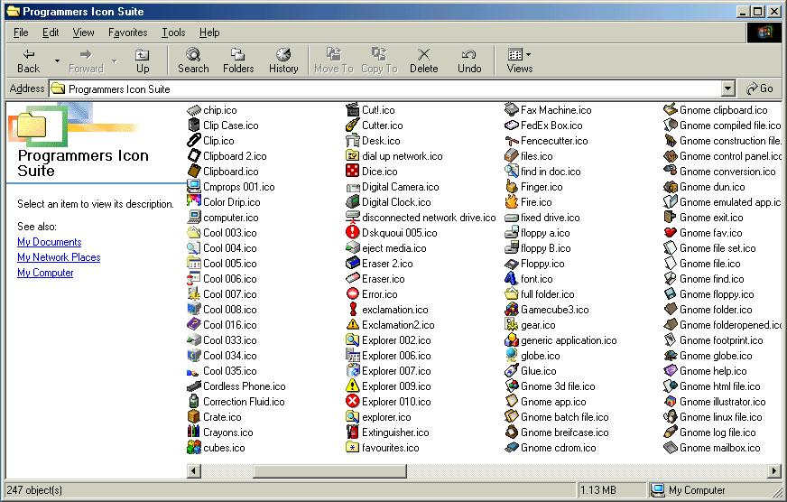



## Programmers Icon Suite

### Description

A MUST HAVE for VB programmers. I often find myself needing icons to use in my apps and always find what I need in this suite. I DO NOT own some of these icons, but collected them from various sources. I DO NOT mean to pirate these icons but simply make them available to the users of PSC, so if you are an athour of some of these icons and wish for them to be removed just tell me.
 
### More Info
 

             |
---                |---
**Submitted On**   |2001-10-03 20:05:26
**By**             |[Chris O'Hara](https://github.com/Planet-Source-Code/PSCIndex/blob/master/ByAuthor/chris-o-hara.md)
**Level**          |Beginner
**User Rating**    |4.0 (16 globes from 4 users)
**Compatibility**  |VB 3\.0, VB 4\.0 \(16\-bit\), VB 4\.0 \(32\-bit\), VB 5\.0, VB 6\.0, VB Script, ASP \(Active Server Pages\) , VBA MS Access, VBA MS Excel
**Category**       |[Graphics](https://github.com/Planet-Source-Code/PSCIndex/blob/master/ByCategory/graphics__1-46.md)
**World**          |[Visual Basic](https://github.com/Planet-Source-Code/PSCIndex/blob/master/ByWorld/visual-basic.md)
**Archive File**   |[Programmer275891052001\.zip](https://github.com/Planet-Source-Code/chris-o-hara-programmers-icon-suite__1-27806/archive/master.zip)

